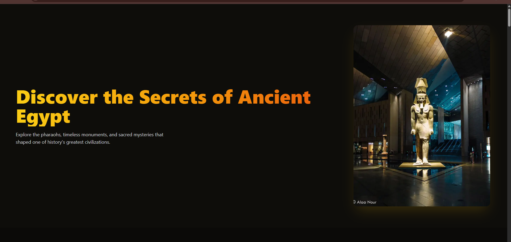
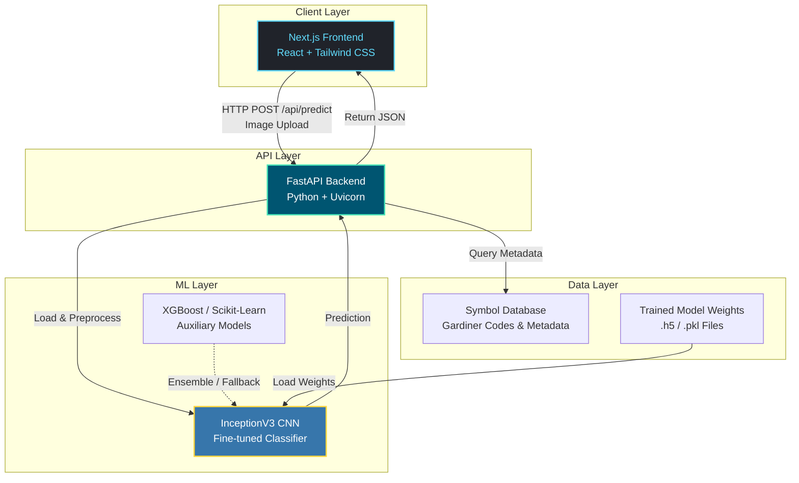
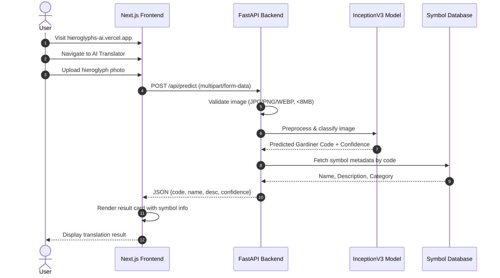
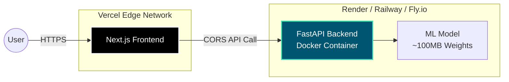
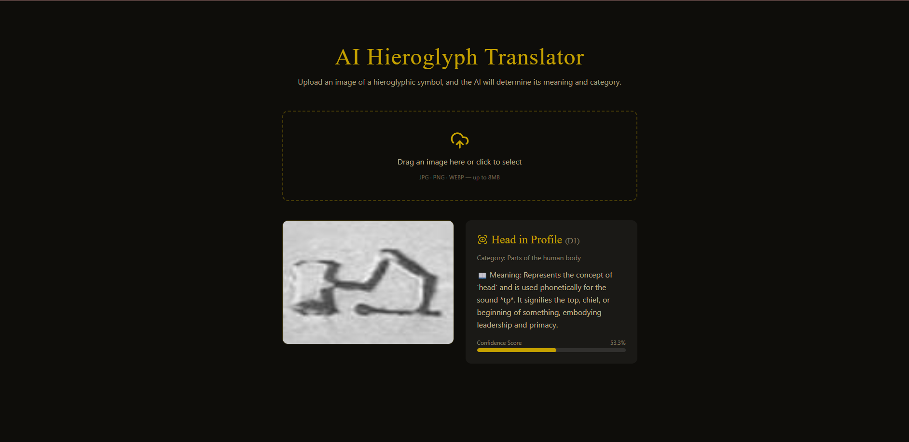

<div align="center">

# 𓂀 Hieroglyphs-AI

**AI-powered Egyptian hieroglyph recognition — upload a photo of a hieroglyph and get an instant translation.**

<p>
  
  
  
  
  
  
  
  
  
</p>

<p>
  <a href="https://hieroglyphs-ai.vercel.app"><strong> Live Demo</strong></a> •
  <a href="#-quick-start"><strong> Quick Start</strong></a> •
  <a href="#-api-reference"><strong> API</strong></a> •
  <a href="#-architecture"><strong> Architecture</strong></a>
</p>



</div>

---

##  Table of Contents

- [The Problem](#-the-problem)
- [Features](#-features)
- [Architecture](#-architecture)
- [Tech Stack](#-tech-stack)
- [User Flow](#-user-flow)
- [API Reference](#-api-reference)
- [Getting Started](#-getting-started)
- [Deployment](#-deployment)
- [Project Structure](#-project-structure)
- [Roadmap](#-roadmap)
- [Contributing](#-contributing)
- [Credits](#-credits)

---

##  The Problem

Reading Egyptian hieroglyphs is a specialized skill — it normally requires years of studying Egyptology or Gardiner's sign list to identify even a single symbol. This creates a barrier for:

| Audience | Pain Point |
|----------|-----------|
|  **Tourists & Museum Visitors** | See hieroglyphs on monuments but have no way to understand them on the spot |
|  **Students & Hobbyists** | Want quick, interactive exploration instead of digging through academic references |
|  **Content Creators / Educators** | Need a fast way to identify and describe symbols they've photographed |

**Hieroglyphs-AI removes that barrier**: upload a photo of a single hieroglyph, and the model identifies it, returns its Gardiner code, name, meaning, and a confidence score — in seconds, from any browser.

---

##  Features

-  **Instant Recognition** — Upload JPG/PNG/WEBP (up to 8MB) and get results in seconds
-  **Gardiner Classification** — Returns official Gardiner code, symbol name, and description
-  **Confidence Scoring** — Know how sure the model is about each prediction
-  **REST API** — Clean API that any client can consume (web, mobile, desktop)
-  **Rich Frontend** — Explore Pharaohs, Monuments, Timeline, Gallery, and 3D Artifacts
-  **Responsive Design** — Works seamlessly on desktop, tablet, and mobile

---

##  Architecture



---

##  Tech Stack

### Frontend
| Technology | Purpose |
|------------|---------|
| **Next.js 14** | React framework with App Router |
| **React 18** | UI component library |
| **Tailwind CSS** | Utility-first styling |
| **Vercel** | Frontend hosting & CI/CD |

### Backend
| Technology | Purpose |
|------------|---------|
| **FastAPI** | High-performance Python API framework |
| **Uvicorn** | ASGI server |
| **Docker** | Containerization |
| **Render** | Backend hosting |

### Machine Learning
| Technology | Purpose |
|------------|---------|
| **InceptionV3** | Deep CNN for image classification |
| **TensorFlow / Keras** | Model training & inference |


---

##  User Flow



---

##  API Reference

Base URL: `https://your-backend-url.com`

### Endpoints Overview

| Endpoint | Method | Description | Auth |
|----------|--------|-------------|------|
| `/api/predict` | `POST` | Classify uploaded hieroglyph image | None |
| `/api/symbols` | `GET` | List all known symbols | None |
| `/api/symbols/{code}` | `GET` | Get single symbol details | None |
| `/api/categories` | `GET` | Get Gardiner categories | None |
| `/api/health` | `GET` | Health & model status check | None |

###  POST /api/predict

Classify a hieroglyph image.

**Request:**
```bash
curl -X POST "https://your-backend-url.com/api/predict" \
  -H "Content-Type: multipart/form-data" \
  -F "file=@hieroglyph.jpg"
```

**Response (200 OK):**
```json
{
  "gardiner_code": "A1",
  "name": "Man Sitting",
  "description": "A seated man, used as a determinative for 'man' or male names.",
  "category": "A: Man and his Occupations",
  "confidence": 0.9734,
  "top_3_predictions": [
    {"code": "A1", "confidence": 0.9734},
    {"code": "A2", "confidence": 0.0182},
    {"code": "A28", "confidence": 0.0051}
  ]
}
```

**Error Responses:**
| Status | Meaning | Example |
|--------|---------|---------|
| `400` | Bad Request | Invalid file type or size > 8MB |
| `422` | Unprocessable | Corrupted or unreadable image |
| `500` | Server Error | Model inference failure |

###  GET /api/symbols

Returns the full database of known symbols.

**Response:**
```json
{
  "total": 1071,
  "symbols": [
    {
      "code": "A1",
      "name": "Man Sitting",
      "category": "A",
      "category_name": "Man and his Occupations",
      "description": "..."
    }
  ]
}
```

###  GET /api/categories

Returns Gardiner's main categories.

**Response:**
```json
{
  "categories": [
    {"code": "A", "name": "Man and his Occupations"},
    {"code": "B", "name": "Woman and her Occupations"},
    {"code": "C", "name": "Anthropomorphic Deities"},
    {"code": "D", "name": "Parts of the Human Body"},
    {"code": "G", "name": "Birds"},
    {"code": "I", "name": "Amphibious Animals, Reptiles, etc."},
    {"code": "M", "name": "Trees and Plants"},
    {"code": "N", "name": "Sky, Earth, Water"},
    {"code": "O", "name": "Buildings, Parts of Buildings, etc."},
    {"code": "Q", "name": "Domestic and Funerary Furniture"},
    {"code": "R", "name": "Temple Furniture and Sacred Emblems"},
    {"code": "S", "name": "Crowns, Dress, Staves, etc."},
    {"code": "T", "name": "Warfare, Hunting, Butchery"},
    {"code": "U", "name": "Agriculture, Crafts, and Professions"},
    {"code": "V", "name": "Rope, Fiber, Baskets, Bags, etc."},
    {"code": "W", "name": "Vessels of Stone and Earthenware"},
    {"code": "X", "name": "Loaves and Cakes"},
    {"code": "Y", "name": "Writings, Games, Music"},
    {"code": "Z", "name": "Strokes, Signs derived from Hieratic, etc."},
    {"code": "Aa", "name": "Unclassified"}
  ]
}
```

###  GET /api/health

Health check — confirms server is up and model is loaded.

**Response:**
```json
{
  "status": "healthy",
  "model_loaded": true,
  "model_name": "InceptionV3",
  "total_symbols": 1071,
  "timestamp": "2026-08-06T14:30:00Z"
}
```

> 📘 **Interactive Docs:** Visit `/docs` on your backend for Swagger UI, or `/redoc` for ReDoc documentation.

---

##  Getting Started

### Prerequisites

- **Node.js** 18+ and npm/yarn
- **Python** 3.10+
- **Git**

### 1. Clone the Repository

```bash
git clone https://github.com/ahmedhamdy-DS/hieroglyphs-ai.git
cd hieroglyphs-ai
```

### 2. Start the Backend

```bash
cd backend

# Create virtual environment
python -m venv .venv

# Activate (Linux/Mac)
source .venv/bin/activate
# Activate (Windows)
# .venv\Scripts\activate

# Install dependencies
pip install -r requirements.txt

# Setup environment
cp .env.example .env
# Edit .env with your settings

# Start server
uvicorn app.main:app --reload --port 8000
```

✅ Backend running at: `http://localhost:8000`  
✅ API Docs at: `http://localhost:8000/docs`

### 3. Start the Frontend

```bash
cd frontend

# Install dependencies
npm install

# Setup environment
cp .env.local.example .env.local
# Set NEXT_PUBLIC_API_URL=http://localhost:8000

# Start dev server
npm run dev
```

✅ Frontend running at: `http://localhost:3000`

###  Environment Variables

#### Backend (`backend/.env`)
| Variable | Required | Default | Description |
|----------|----------|---------|-------------|
| `ALLOWED_ORIGINS` | Yes | — | CORS allowed origins (comma-separated) |
| `MODEL_PATH` | No | `./model` | Path to trained model weights |
| `LOG_LEVEL` | No | `INFO` | Logging level |

#### Frontend (`frontend/.env.local`)
| Variable | Required | Default | Description |
|----------|----------|---------|-------------|
| `NEXT_PUBLIC_API_URL` | Yes | — | Backend API base URL |
| `NEXT_PUBLIC_APP_NAME` | No | `Hieroglyphs-AI` | App display name |

---

##  Deployment

### Architecture Overview



### Step-by-Step Deployment

| Step | Service | Action |
|------|---------|--------|
| 1 | **Backend** | Deploy `backend/` folder to Render (Docker-based) |
| 2 | | Copy the backend URL: `https://hieroglyphs-ai.onrender.com` |
| 3 | **Frontend** | Import `frontend/` repo to Vercel |
| 4 | | Set **Framework Preset** → `Next.js` |
| 5 | | Add env var: `NEXT_PUBLIC_API_URL` = your backend URL |
| 6 | **Backend** | Set env var: `ALLOWED_ORIGINS` = your Vercel domain |

###  Cold Start Note

> On Render's free tier, the backend spins down after ~15 min of inactivity. First request after idle time can take **30–60s** while the model warms up.
>
> **Solutions:**
> - Upgrade to a paid instance (no spin-down)
> - Set up a keep-alive ping to `/api/health` every ~10 minutes
> - Use a service like UptimeRobot or cron-job.org for free pings

---

## 📁 Project Structure

```
hieroglyphs-ai/
├── 📂 backend/
│   ├── 📂 app/
│   │   ├── __init__.py
│   │   ├── main.py              # FastAPI entry point
│   │   ├── models.py            # ML model loading & inference
│   │   ├── routes.py            # API endpoints
│   │   └── utils.py             # Image preprocessing helpers
│   ├── 📂 model/
│   │   └── inceptionv3_hieroglyphs.h5
│   ├── 📂 data/
│   │   └── symbols.json         # Gardiner symbol database
│   ├── Dockerfile
│   ├── requirements.txt
│   └── .env.example
│
├── 📂 frontend/
│   ├── 📂 app/
│   │   ├── page.tsx             # Landing page
│   │   ├── layout.tsx           # Root layout
│   │   └── globals.css
│   ├── 📂 components/
│   │   ├── Hero.tsx
│   │   ├── Translator.tsx       # AI upload component
│   │   ├── Pharaohs.tsx
│   │   ├── Monuments.tsx
│   │   ├── Timeline.tsx
│   │   ├── Gallery.tsx
│   │   └── Artifacts3D.tsx
│   ├── 📂 lib/
│   │   └── api.ts               # API client functions
│   ├── next.config.js
│   ├── tailwind.config.ts
│   └── .env.local.example
│
├── 📂 ML/
│   ├── 📂 Docs/
│   │   ├── Overview.png
│   │   └── Translator.png
│   ├── 📂 Notebooks/
│   │   └── train_inceptionv3.ipynb
│   └── 📂 pages/
│       └── 1_Translator.py      # Original Streamlit prototype
│
├── README.md
└── LICENSE
```

---

##  Roadmap

- [ ] **Batch Upload** — Recognize multiple hieroglyphs in one photo (segment + classify each)
- [ ] **Confidence Threshold UI** — Flag low-confidence predictions instead of showing a guess
- [ ] **Mobile Camera Capture** — Direct camera access, not just file upload
- [ ] **Expand Symbol Database** — Add rare and variant signs beyond current label set
- [ ] **Prediction Caching** — Cache frequent predictions to reduce backend load
- [ ] **Multi-language Support** — Translations in Arabic, French, German, etc.
- [ ] **Offline Mode** — Lightweight model for on-device inference (TensorFlow.js)
- [ ] **Historical Context** — Link symbols to their usage in real texts and monuments

---

##  Contributing

Contributions are welcome! Here's how to get started:

1. **Fork** the repository
2. **Create a branch**: `git checkout -b feature/amazing-feature`
3. **Commit your changes**: `git commit -m 'Add amazing feature'`
4. **Push to the branch**: `git push origin feature/amazing-feature`
5. **Open a Pull Request**

### Development Guidelines

- Follow PEP 8 for Python code
- Use TypeScript strict mode for frontend
- Add tests for new API endpoints
- Update documentation for any breaking changes

---

##  Screenshots

<div align="center">
  
  <p><em>AI Hieroglyph Translator — upload and get instant results</em></p>
</div>

---

##  License

This project is licensed under the **MIT License** — see the [LICENSE](LICENSE) file for details.

---

##  Credits

Built by **Ahmed Hamdy** — Data Scientist & ML Engineer.

<p>
  <a href="https://linkedin.com/in/ahmed-hamdy-4569a8360">
    
  </a>
  <a href="https://my-web-3ciq.vercel.app/">
    
  </a>
  <a href="https://github.com/ahmedhamdy-DS">
    
  </a>
</p>

---

<div align="center">
  <p> Star this repo if you find it useful!</p>
  <p><strong>𓂀 Made with passion for Ancient Egypt</strong></p>
</div>
